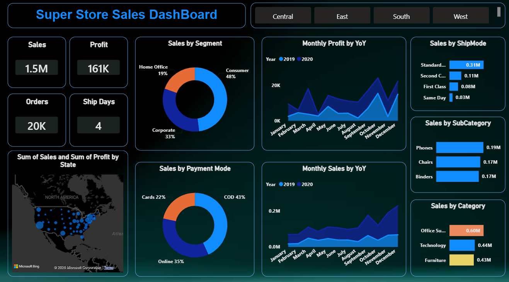
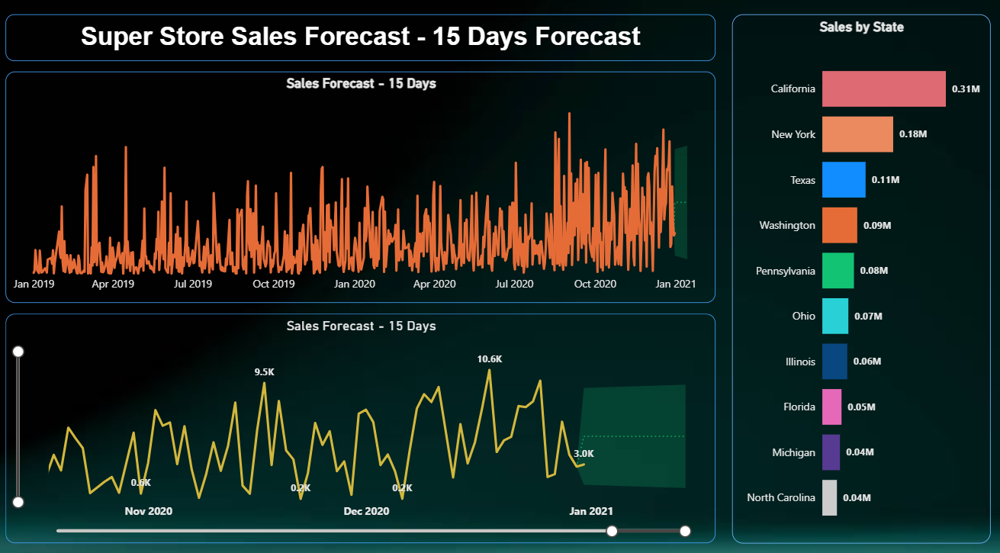

# Super Store Sales Analysis – Power BI

## Project Overview

This project is a Power BI dashboard created to analyze Super Store sales and profit data.

The dashboard provides an interactive view of sales performance based on category, sub-category, customer segment, region, state, shipping mode and payment mode.

A separate page is also included for sales forecasting for the next 15 days.

## Tools Used

* Power BI
* Power Query
* DAX
* Data Visualization

## Dashboard

The dashboard includes the following analysis:

* Total Sales
* Total Profit
* Sales by Category
* Sales by Sub-Category
* Sales by Customer Segment
* Sales by Ship Mode
* Sales by Payment Mode
* Region-wise analysis
* State-wise sales and profit analysis
* Monthly Sales Trend
* Monthly Profit Trend
* Interactive filters and slicers

## Sales Forecast

The project also contains a sales forecast page which shows the sales trend and a 15-day forecast based on the available sales data.

## Visualizations Used

* KPI Cards
* Bar Charts
* Line Charts
* Donut Charts
* Map
* Slicers
* Forecast Chart

## Project Structure

```text
Super-Store-Sales-PowerBI/
│
├── Super-Store-Sales-Dashboard.pbix
│
├── screenshots/
│   ├── dashboard.png
│   └── forecast.png
│
└── README.md
```

## Dashboard Preview

### Sales Dashboard



### Sales Forecast



## Project Objective

The objective of this project was to practice Power BI and build an interactive dashboard for analyzing sales and profit performance.

The dashboard helps in understanding sales trends, identifying better-performing categories and segments, and analyzing performance across different regions and states.

## Author

Shailendra Prajapat


